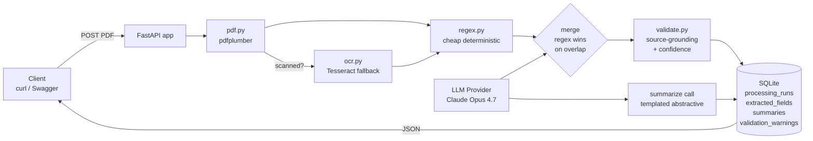

# Insurance Document Summarizer

A FastAPI service that ingests insurance policy PDFs, extracts structured
fields via a hybrid regex + LLM pipeline (with Tesseract OCR fallback for
scanned PDFs), runs source-grounded validation with per-field confidence
scoring, and produces a human-readable Markdown summary. The LLM layer is
vendor-neutral — pipeline code never imports the Anthropic SDK directly, so
swapping providers or models is a config change rather than a refactor.

> **Build context:** ~1.5 hours wall-clock as a take-home submission, built
> with AI-assisted parallel agent execution (Claude Code orchestrating
> sub-agents per phase). The brief's "Recommended Scope" suggested 45-60
> minutes for implementation; the extra time was spent on the upgrades
> beyond the brief minimum — hybrid regex + LLM extraction, OCR fallback,
> source-grounded validation, 28 tests, mini eval harness, vendor-neutral
> LLM abstraction, and the design rationale doc. Every design decision in
> the rationale is a defensible technical choice, not a tool output.

## Quick Start

### Prerequisites

- Python 3.11+
- `tesseract` (`brew install tesseract` on Mac, `apt install tesseract-ocr` on Linux)
- `poppler` (`brew install poppler` on Mac, `apt install poppler-utils` on Linux)
- Anthropic API key (or skip if you just want the eval harness to run with `--mock`)

### Install

```bash
git clone https://github.com/jerry861200/insurance-summarizer.git
cd insurance-summarizer
python3.11 -m venv venv
source venv/bin/activate
pip install -r requirements.txt
cp .env.example .env  # then edit to set ANTHROPIC_API_KEY, or set LLM_PROVIDER=openai + OPENAI_API_KEY to use OpenAI instead
```

### Run

```bash
uvicorn app.main:app --port 8000 --reload
```

In another terminal:

```bash
curl http://localhost:8000/healthz
open http://localhost:8000/docs  # Swagger UI

# Demo against the sample PDF
curl -X POST http://localhost:8000/documents \
  -F "file=@sample/leland_stanford_policy.pdf" | jq .

# Run the eval harness
python -m eval.run_eval --live --output docs/eval_results.md
```

Expected on the sample: `policy_number = "VF99999990"`,
`insured_name = "LELAND STANFORD"`, `effective_date = "2008-05-01"`,
`face_amount = 500000`, `premium_amount = 36`, `premium_frequency = "monthly"`,
with confidence >= 0.9 on the regex-extracted fields.

## Architecture



One FastAPI process; one synchronous pipeline per upload. PDF -> optional OCR
-> regex pre-pass -> LLM extraction -> merge (regex wins overlap) ->
source-grounded validation -> persist to SQLite -> LLM summary -> JSON
response. See [docs/architecture.md](docs/architecture.md) for the per-module
breakdown, database schema, and request lifecycle.

## Design Decisions

Eleven decisions, each in "Chose X over Y because Z. With more time: W (M#)."
format. Numbers in parentheses cite milestones in the post-MVP roadmap.

1. **PDF extraction (native path):** Chose **`pdfplumber` with `layout=True`**
   over `PyPDF2` or going straight to AWS Textract because the sample PDF is
   native-text and `pdfplumber` preserves multi-column reading order and
   table structure that the LLM uses to disambiguate fields. `PyPDF2` returns
   text with broken reading order on multi-column documents; Textract is
   accurate but adds cloud dependency and per-page cost for documents that
   don't need it. With more time: AWS Textract or Azure Document Intelligence
   (the latter has pre-built insurance models) for higher accuracy on
   complex layouts (M3).

2. **Scanned PDF handling:** Chose **Tesseract via `pdf2image` + `pytesseract`
   as a runtime fallback** over making OCR a required step or upgrading
   straight to a cloud OCR. The pipeline detects scanned PDFs by character
   density (`chars_per_page < 100`) and only invokes OCR when needed —
   native-text PDFs never pay the OCR latency. Tesseract auto-locates its
   binary across PATH, Homebrew, and Linux paths so it works in sandboxed
   environments. With more time: AWS Textract or Azure Document Intelligence
   for accuracy on real-world scans (M3).

3. **Information extraction:** Chose **hybrid regex + LLM** over pure LLM or
   pure regex because regex catches `policy_number`, `effective_date`,
   `expiration_date`, `premium_amount`, and `face_amount` at near-zero cost
   when the format matches (the Leland Stanford sample fills 5/5), while the
   LLM handles semantic fields (`insurer_name` variants, `exclusions`,
   `coverage_limits`) and novel insurer formats. Regex wins on overlap because
   it's deterministic and can't hallucinate. With more time: per-insurer
   prompt overrides for the top N carriers (M8) and cross-model verification
   on high-stakes fields (M12).

4. **Field schema:** Chose **typed columns + raw JSON blob** on
   `extracted_fields` over either-or because typed columns enable indexed
   queries (`WHERE policy_number = X`) for broker tools, while
   `raw_extraction_json` preserves the full LLM output so new schema fields
   don't require migrations or re-extraction. `confidence_json` and
   `extraction_method_per_field_json` are also JSON blobs because they're
   per-run, per-field metadata that doesn't justify its own table. With more
   time: Postgres `JSONB` with a GIN index gives both queries and document
   flexibility without giving up the relational model.

5. **Summarization:** Chose **templated abstractive** over extractive because
   policy legalese reads badly verbatim and the broker audience needs the
   same sections in the same place every time. The summary prompt forces a
   fixed Markdown structure (Policy Summary header, Key Terms, Notable
   Exclusions & Conditions, Things to Verify) so the LLM can't omit a
   category like exclusions, and verbatim field substitution for
   IDs/dates/money means the broker always sees consistent numbers. With more
   time: citation-augmented summaries where every fact links back to its
   source page (M14).

6. **Hallucination defense:** Chose **source-grounding validation** over
   trusting the LLM's `tool_use` output. `validate.py` re-checks every
   non-null field against the source text — dates and money are normalized
   to candidate forms (`$500,000`, `500000`, `500,000.00`, etc.) — and any
   field that doesn't ground gets a warning and confidence drops to 0.55.
   This makes silent hallucination essentially impossible on the fields where
   it matters (IDs, dates, money, names). With more time: cross-model
   verification with a cheap second model (M12) for the long tail.

7. **Versioning:** Chose **append-only `processing_runs`** with auto-incremented
   `run_number` over updating `extracted_fields` in place because losing
   history makes prompt iteration unsafe — I can't tell whether a new prompt
   is better without an old extraction to compare. Append-only also gives me
   a free audit trail (which model/prompt produced which fields when), and
   the `pdf_sha256` index sets up duplicate-upload short-circuiting. With
   more time: a cold-storage policy that archives runs older than the last
   3 per document once volume justifies it (M15).

8. **API model:** Chose **synchronous request handling** over an async
   queue with Celery + Redis because the demo target is one broker, one PDF
   at a time, and pipeline wall-clock is 10-30 seconds — well under the
   threshold where polling becomes friction. Async adds Redis as a hard
   dependency and a polling protocol for clients, both of which would have
   surface-failed during the interview demo. With more time: Celery workers
   with `POST` returning 202 + job ID once volume crosses 10 docs/min or
   30-page documents become common (M5).

9. **Storage:** Chose **SQLite + local filesystem** over Postgres + S3
   because the entire stack starts with `git clone && pip install` — no
   infrastructure to provision, no credentials to configure for the demo,
   and the schema is a one-line URL swap to Postgres when needed
   (`DATABASE_URL=postgresql://...`). PDF storage is similarly one
   `storage.save_pdf_bytes()` implementation change to use boto3 + presigned
   URLs. With more time: Postgres + S3 with the same SQLAlchemy ORM (M6).

10. **LLM model choice:** Chose **Claude Opus 4.7 for development and
    Sonnet 4.6 for production**, single model for both extraction and
    summary calls, switchable via `ANTHROPIC_MODEL` env var. Opus 4.7 in
    dev because cost is $0.5-2 total across all MVP and eval runs — trivial
    versus the interview signal of "I picked max quality and have a clear
    cost-optimization path." Two-models-for-two-calls would have doubled
    the debugging surface for marginal token savings at MVP scale. With
    more time: benchmark Haiku 4.5 for extraction-only against Sonnet using
    the eval harness (M10) once monthly LLM bill > $1k.

11. **LLM provider abstraction:** Chose **`LLMProvider` Protocol with a
    factory** over importing the Anthropic SDK directly in `pipeline.py`
    because vendor lock-in is a real procurement risk in regulated industries
    (insurance, healthcare). All LLM calls go through
    `app.extractors.llm.base.LLMProvider`; the concrete `AnthropicProvider`
    lives in its own file and `get_llm_provider(settings)` selects by config.
    Swapping to OpenAI or a local Llama is a new file in
    `app/extractors/llm/` with zero pipeline changes; mocking in tests is
    replacing one Protocol implementation with a stub. Cost is ~50 lines;
    value is every vendor/model decision becomes a config change. No
    obvious upgrade — this is one of the few decisions where the MVP
    version IS the production version.

## What's Out of Scope

- **Web UI** — Swagger UI + curl are the demo surface
- **Auth / multi-tenancy / per-org isolation** — no real users yet (M1)
- **Async processing** — sync is fine for 1 broker, 1 PDF (M5)
- **Postgres + S3** — 1-line URL swap when needed (M6)
- **AWS Textract / Azure Document Intelligence** — Tesseract handles MVP scanning (M3)
- **PII redaction, i18n, prompt caching, multi-pass verification, per-insurer prompts** — all tracked in the milestone roadmap

## What I'd Build Next

Top 5 from the post-MVP roadmap:

1. **M1 — Auth + RBAC.** OAuth2 / API keys with per-org row-level isolation. Blocker for any real user.
2. **M2 — Encryption at rest + audit log.** DB column encryption for PII, file encryption at rest, who-accessed-what log. Compliance pre-launch.
3. **M3 — OCR upgrade.** Swap Tesseract for AWS Textract or Azure Document Intelligence (Azure has pre-built insurance models for ACORD forms). Drop-in replacement for `app/ocr.py`.
4. **M4 — Eval harness expansion (5 -> 50+ PDFs).** ACORD forms + COI + life + auto + home. Gate CI on accuracy regression vs baseline.
5. **M5 — Async processing.** Celery + Redis; `POST` returns 202 + job ID; client polls status. Trigger: > 10 docs/min sustained or 30-page documents become common.

The full roadmap (M1-M22) with tiers, effort, value type, and trigger
conditions is in the plan document.

## Project Structure

```
insurance-summarizer/
|-- README.md                              This file
|-- requirements.txt
|-- pyproject.toml                         Ruff + pytest config
|-- .env.example
|-- app/
|   |-- main.py                            FastAPI factory + /healthz
|   |-- config.py                          pydantic-settings
|   |-- routes.py                          HTTP endpoints
|   |-- pipeline.py                        Orchestrator
|   |-- pdf.py                             pdfplumber + scanned detection
|   |-- ocr.py                             Tesseract fallback
|   |-- validate.py                        Source-grounding + confidence
|   |-- schemas.py                         Pydantic API contracts
|   |-- models.py                          SQLAlchemy ORM (5 tables)
|   |-- storage.py                         DB engine + file helpers
|   `-- extractors/
|       |-- regex.py                       Deterministic pre-pass
|       `-- llm/
|           |-- base.py                    LLMProvider Protocol
|           |-- prompts.py                 Vendor-neutral prompts + tool schema
|           `-- anthropic_provider.py      Anthropic SDK impl
|-- tests/                                 28 tests across pdf/regex/validate/routes
|-- eval/                                  Eval harness + golden PDFs
|-- sample/leland_stanford_policy.pdf      Sample for demo
`-- docs/
    |-- architecture.md
    |-- design_rationale.md
    `-- sample_summary.md
```

## Tests

The test suite covers `app/pdf.py` (6 tests), `app/extractors/regex.py` (7),
`app/validate.py` (6), and the FastAPI routes (9) for 28 tests total. The
route tests use a mock `LLMProvider` so CI doesn't burn API calls, and the
integration test confirms end-to-end that `POST /documents` against the
Leland Stanford PDF returns `policy_number = "VF99999990"`. Run with:

```bash
pytest tests/ -v
```

## Deeper Reading

- [docs/architecture.md](docs/architecture.md) — mermaid diagram, per-module breakdown, database schema, request lifecycle, error handling
- [docs/design_rationale.md](docs/design_rationale.md) — ~3000 words organized by the brief's "Technical Considerations" headings; each subsection has a decision, trade-off table, production trade-off, and an interview Q&A
- [docs/sample_summary.md](docs/sample_summary.md) — example Markdown summary output on the Leland Stanford sample

## License

Built as a take-home case study for interview evaluation.
