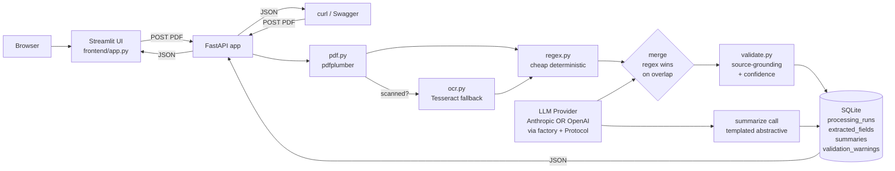

# Insurance Document Summarizer

A FastAPI service that ingests insurance policy PDFs, extracts structured
fields via a hybrid regex + LLM pipeline (with Tesseract OCR fallback for
scanned PDFs), runs source-grounded validation with per-field confidence
scoring, and produces a human-readable Markdown summary. The LLM layer is
vendor-neutral — pipeline code never imports the Anthropic SDK directly, so
swapping providers or models is a config change rather than a refactor.

> **Build context:** Built in three iterations using Claude Code with AI-assisted
> parallel agent execution. Every design decision is a defensible technical
> choice, not a tool output.
> - **v1 (~1.5 hr, 2026-05-16):** core pipeline + 28 tests + 11 design decisions
>   + comprehensive design rationale. Hybrid regex+LLM, OCR fallback,
>   source-grounded validation, mini eval harness, vendor-neutral LLM abstraction.
> - **v2 (~3 hr, 2026-05-16):** OpenAI provider (proved the D12 vendor abstraction
>   ships without pipeline changes), Streamlit frontend, Railway deploy config,
>   eval expansion 1 → 3 cases.
> - **v3 (~4 hr, 2026-05-17):** three orthogonal axes run as parallel agents in
>   isolated worktrees — Ops (Docker + GitHub Actions CI + cross-model verifier),
>   UX (PDF preview + source page badges + batch upload), Accuracy (3 new
>   synthetic cases + LLM-as-judge). 52 tests, eval at 6 cases.

## Quick Start

### Prerequisites

- Python 3.11+
- `tesseract` (`brew install tesseract` on Mac, `apt install tesseract-ocr` on Linux)
- `poppler` (`brew install poppler` on Mac, `apt install poppler-utils` on Linux)
- Anthropic API key OR OpenAI API key (set `LLM_PROVIDER=anthropic` or `openai`)
- Streamlit (`pip install -r requirements.txt` includes it; only needed if running the UI)

### Install

```bash
git clone https://github.com/jerry861200/insurance-summarizer.git
cd insurance-summarizer
python3.11 -m venv venv
source venv/bin/activate
pip install -r requirements.txt
cp .env.example .env  # then edit to set ANTHROPIC_API_KEY, or set LLM_PROVIDER=openai + OPENAI_API_KEY to use OpenAI instead
```

### Run

```bash
uvicorn app.main:app --port 8000 --reload
```

In another terminal:

```bash
curl http://localhost:8000/healthz
open http://localhost:8000/docs  # Swagger UI

# Demo against the sample PDF
curl -X POST http://localhost:8000/documents \
  -F "file=@sample/leland_stanford_policy.pdf" | jq .

# Run the eval harness
python -m eval.run_eval --live --output docs/eval_results.md
```

Expected on the sample: `policy_number = "VF99999990"`,
`insured_name = "LELAND STANFORD"`, `effective_date = "2008-05-01"`,
`face_amount = 500000`, `premium_amount = 36`, `premium_frequency = "monthly"`,
with confidence >= 0.9 on the regex-extracted fields.

### Run with Streamlit UI (optional but recommended for demo)

```bash
# In a second terminal (backend running on port 8000):
streamlit run frontend/app.py
# Opens http://localhost:8501

# Or point at a deployed backend:
BACKEND_URL=https://your-deploy.up.railway.app streamlit run frontend/app.py
```

### Run via Docker (v3, no local Python needed)

```bash
cp .env.example .env  # fill in OPENAI_API_KEY or ANTHROPIC_API_KEY
docker compose up --build
# First build ~3 min (tesseract + poppler); subsequent builds are seconds.
# API at http://localhost:8000/healthz · Swagger at /docs
```

See [docs/deploy.md](docs/deploy.md) for the full Docker walkthrough and the
Railway alternative.

## Architecture



One FastAPI process; one synchronous pipeline per upload. PDF -> optional OCR
-> regex pre-pass -> LLM extraction -> merge (regex wins overlap) ->
source-grounded validation -> persist to SQLite -> LLM summary -> JSON
response. See [docs/architecture.md](docs/architecture.md) for the per-module
breakdown, database schema, and request lifecycle.

## Design Decisions

Eleven decisions, each in "Chose X over Y because Z. With more time: W (M#)."
format. Numbers in parentheses cite milestones in the post-MVP roadmap.

1. **PDF extraction (native path):** Chose **`pdfplumber` with `layout=True`**
   over `PyPDF2` or going straight to AWS Textract because the sample PDF is
   native-text and `pdfplumber` preserves multi-column reading order and
   table structure that the LLM uses to disambiguate fields. `PyPDF2` returns
   text with broken reading order on multi-column documents; Textract is
   accurate but adds cloud dependency and per-page cost for documents that
   don't need it. With more time: AWS Textract or Azure Document Intelligence
   (the latter has pre-built insurance models) for higher accuracy on
   complex layouts (M3).

2. **Scanned PDF handling:** Chose **Tesseract via `pdf2image` + `pytesseract`
   as a runtime fallback** over making OCR a required step or upgrading
   straight to a cloud OCR. The pipeline detects scanned PDFs by character
   density (`chars_per_page < 100`) and only invokes OCR when needed —
   native-text PDFs never pay the OCR latency. Tesseract auto-locates its
   binary across PATH, Homebrew, and Linux paths so it works in sandboxed
   environments. With more time: AWS Textract or Azure Document Intelligence
   for accuracy on real-world scans (M3).

3. **Information extraction:** Chose **hybrid regex + LLM** over pure LLM or
   pure regex because regex catches `policy_number`, `effective_date`,
   `expiration_date`, `premium_amount`, and `face_amount` at near-zero cost
   when the format matches (the Leland Stanford sample fills 5/5), while the
   LLM handles semantic fields (`insurer_name` variants, `exclusions`,
   `coverage_limits`) and novel insurer formats. Regex wins on overlap because
   it's deterministic and can't hallucinate. With more time: per-insurer
   prompt overrides for the top N carriers (M8) and cross-model verification
   on high-stakes fields (M12).

4. **Field schema:** Chose **typed columns + raw JSON blob** on
   `extracted_fields` over either-or because typed columns enable indexed
   queries (`WHERE policy_number = X`) for broker tools, while
   `raw_extraction_json` preserves the full LLM output so new schema fields
   don't require migrations or re-extraction. `confidence_json` and
   `extraction_method_per_field_json` are also JSON blobs because they're
   per-run, per-field metadata that doesn't justify its own table. With more
   time: Postgres `JSONB` with a GIN index gives both queries and document
   flexibility without giving up the relational model.

5. **Summarization:** Chose **templated abstractive** over extractive because
   policy legalese reads badly verbatim and the broker audience needs the
   same sections in the same place every time. The summary prompt forces a
   fixed Markdown structure (Policy Summary header, Key Terms, Notable
   Exclusions & Conditions, Things to Verify) so the LLM can't omit a
   category like exclusions, and verbatim field substitution for
   IDs/dates/money means the broker always sees consistent numbers. With more
   time: citation-augmented summaries where every fact links back to its
   source page (M14).

6. **Hallucination defense:** Chose **source-grounding validation** over
   trusting the LLM's `tool_use` output. `validate.py` re-checks every
   non-null field against the source text — dates and money are normalized
   to candidate forms (`$500,000`, `500000`, `500,000.00`, etc.) — and any
   field that doesn't ground gets a warning and confidence drops to 0.55.
   This makes silent hallucination essentially impossible on the fields where
   it matters (IDs, dates, money, names). With more time: cross-model
   verification with a cheap second model (M12) for the long tail.

7. **Versioning:** Chose **append-only `processing_runs`** with auto-incremented
   `run_number` over updating `extracted_fields` in place because losing
   history makes prompt iteration unsafe — I can't tell whether a new prompt
   is better without an old extraction to compare. Append-only also gives me
   a free audit trail (which model/prompt produced which fields when), and
   the `pdf_sha256` index sets up duplicate-upload short-circuiting. With
   more time: a cold-storage policy that archives runs older than the last
   3 per document once volume justifies it (M15).

8. **API model:** Chose **synchronous request handling** over an async
   queue with Celery + Redis because the demo target is one broker, one PDF
   at a time, and pipeline wall-clock is 10-30 seconds — well under the
   threshold where polling becomes friction. Async adds Redis as a hard
   dependency and a polling protocol for clients, both of which would have
   surface-failed during the interview demo. With more time: Celery workers
   with `POST` returning 202 + job ID once volume crosses 10 docs/min or
   30-page documents become common (M5).

9. **Storage:** Chose **SQLite + local filesystem** over Postgres + S3
   because the entire stack starts with `git clone && pip install` — no
   infrastructure to provision, no credentials to configure for the demo,
   and the schema is a one-line URL swap to Postgres when needed
   (`DATABASE_URL=postgresql://...`). PDF storage is similarly one
   `storage.save_pdf_bytes()` implementation change to use boto3 + presigned
   URLs. With more time: Postgres + S3 with the same SQLAlchemy ORM (M6).

10. **LLM model choice:** Chose **Claude Opus 4.7 for development and
    Sonnet 4.6 for production**, single model for both extraction and
    summary calls, switchable via `ANTHROPIC_MODEL` env var. Opus 4.7 in
    dev because cost is $0.5-2 total across all MVP and eval runs — trivial
    versus the interview signal of "I picked max quality and have a clear
    cost-optimization path." Two-models-for-two-calls would have doubled
    the debugging surface for marginal token savings at MVP scale. With
    more time: benchmark Haiku 4.5 for extraction-only against Sonnet using
    the eval harness (M10) once monthly LLM bill > $1k.

11. **LLM provider abstraction:** Chose **`LLMProvider` Protocol with a
    factory** over importing the Anthropic SDK directly in `pipeline.py`
    because vendor lock-in is a real procurement risk in regulated industries
    (insurance, healthcare). All LLM calls go through
    `app.extractors.llm.base.LLMProvider`; the concrete `AnthropicProvider`
    lives in its own file and `get_llm_provider(settings)` selects by config.
    Swapping to OpenAI or a local Llama is a new file in
    `app/extractors/llm/` with zero pipeline changes; mocking in tests is
    replacing one Protocol implementation with a stub. Cost is ~50 lines;
    value is every vendor/model decision becomes a config change. No
    obvious upgrade — this is one of the few decisions where the MVP
    version IS the production version.

## What's new in v3

Three orthogonal axes shipped via three parallel agents in isolated git
worktrees — chose this over sequential work because file ownership was
disjoint (Ops touches infra/pipeline; UX touches frontend/schemas/routes;
Accuracy touches `eval/*`) and the integration merge was nearly conflict-free.

| Axis | What landed | Why |
|---|---|---|
| **Ops** | `Dockerfile` + `docker-compose.yml` for any-environment deploy; `.github/workflows/ci.yml` runs pytest + eval regression gate; `app/extractors/llm/verifier.py` (opt-in cross-model verification — M12) | Reproducible deploy beyond Railway; quality gate on every PR; opt-in disagreement detection when both API keys are available |
| **UX** | New "PDF Preview" tab (`streamlit-pdf-viewer` with iframe fallback); `📄 p.N` page badges next to each extracted field; multi-file batch upload with progress + summary table; **fixed a silent v2 bug** where `confidence`, `extraction_method_per_field`, and warnings were declared in `DocumentResponse` but never populated | Source provenance answers "where did this come from?" with a click; batch demo answers "what if you have 50 policies?"; bug fix made existing confidence bars actually show real scores |
| **Accuracy** | 3 new synthetic eval cases (Commercial GL, Auto multi-vehicle, HO-3 homeowners); `eval/judge.py` LLM-as-judge for semantic similarity on free-text fields; `compare_semantic` in `eval/metrics.py`; `--judge` flag in `run_eval` | Format diversity (different field labels, currency formats, multi-vehicle); honest scoring on outputs like exclusions where exact-match is brittle |

### Tests jumped 32 → 52

- +4 verifier tests (mock `LLMProvider` at the Protocol boundary, not HTTP)
- +1 frontend smoke test (`import frontend.app` doesn't raise)
- +15 judge / eval tests (mocked judge callables; zero real API calls)
- +0 new route tests but added assertions for the now-populated response fields

### Eval matrix at v3

6 cases: 1 real (Leland Stanford Pacific Life) + 5 synthetic (Term Life,
Whole Life binder, Commercial GL, Auto multi-vehicle, HO-3 homeowners). Regex-only
baseline average score 39% — CI gate is set to 30% with deliberate slack to
catch regressions without being flaky.

### Why these three axes, NOT others

| Cut | Reason |
|---|---|
| **Span-level highlighting** (overlay boxes on PDF for exact source) | ~3h alone; needs PDF.js + regex offset capture + storage schema change. Page-level badges (B3) deliver 80% of the value at ~25% of the effort. Add only if interview signals deep interest. |
| **Real ACORD/COI eval PDFs** | Meta sandbox can't fetch external URLs; user deferred. 5 synthetic cases at diverse formats prove the harness scales — real PDFs are an upgrade, not a foundation. |
| **Postgres + S3** | 1-line URL swap (D4); zero behavior diff at MVP scale; wait for multi-user trigger. |
| **Auth + RBAC** | No real users; login friction every demo. |
| **Async / Celery** | Sync 10-30s per PDF is fine; async needs Redis = infra surface. |
| **Per-insurer prompt routing** | Chicken-and-egg without 50+ insurer-labeled docs. |
| **Sentry / Datadog** | Logs + uvicorn stderr cover MVP; production-only. |

## What's new in v2

| Area | v1 (1.5h) | v2 (~3h additional) |
|---|---|---|
| **LLM providers** | Anthropic only | Anthropic + OpenAI (factory pattern; swap via `LLM_PROVIDER` env var) |
| **Frontend** | Swagger UI / curl only | Streamlit UI: upload + extracted fields + Markdown summary + warnings inspector |
| **Deploy** | Local only | Railway-ready: `Procfile`, `railway.json`, `nixpacks.toml` (auto-installs tesseract + poppler), `docs/deploy.md` walkthrough |
| **Eval cases** | 1 hand-labeled (Leland Stanford) | 3 cases: real Pacific Life + 2 synthetic (reportlab) — different insurer format + missing-fields edge case |
| **Tests** | 28 | 32 (+4 OpenAI provider tests, all mocked via respx) |

## What's Out of Scope

- **Web UI** — Swagger UI + curl are the demo surface
- **Auth / multi-tenancy / per-org isolation** — no real users yet (M1)
- **Async processing** — sync is fine for 1 broker, 1 PDF (M5)
- **Postgres + S3** — 1-line URL swap when needed (M6)
- **AWS Textract / Azure Document Intelligence** — Tesseract handles MVP scanning (M3)
- **PII redaction, i18n, prompt caching, multi-pass verification, per-insurer prompts** — all tracked in the milestone roadmap

## What I'd Build Next

Top 5 from the post-MVP roadmap (M12 verifier and M13 CI gate were landed in v3):

1. **M1 — Auth + RBAC.** OAuth2 / API keys with per-org row-level isolation. Blocker for any real user.
2. **M2 — Encryption at rest + audit log.** DB column encryption for PII, file encryption at rest, who-accessed-what log. Compliance pre-launch.
3. **M3 — OCR upgrade.** Swap Tesseract for AWS Textract or Azure Document Intelligence (Azure has pre-built insurance models for ACORD forms). Drop-in replacement for `app/ocr.py`.
4. **M4 — Eval harness expansion (6 → 50+ PDFs).** Real ACORD forms + COI + life + auto + home labeled corpus. The v3 CI gate already wires the regression check; just feed it more cases.
5. **M14 — Span-level source highlighting.** v3 ships page-level badges; the natural follow-on is bounding-box overlay tied to specific text spans (requires regex offset capture + PDF.js).

The full roadmap (M1-M22) with tiers, effort, value type, and trigger
conditions is in the plan document.

## Project Structure

```
insurance-summarizer/
|-- README.md                              This file
|-- requirements.txt
|-- pyproject.toml                         Ruff + pytest config
|-- .env.example
|-- Dockerfile                             NEW v3: python:3.11-slim + tesseract + poppler
|-- docker-compose.yml                     NEW v3: single-service compose; storage as volume
|-- .dockerignore                          NEW v3
|-- .github/workflows/ci.yml               NEW v3: pytest + eval regression gate
|-- Procfile                               Railway: web process command
|-- railway.json                           Railway: build + healthcheck config
|-- nixpacks.toml                          Railway: install tesseract + poppler
|-- .python-version                        Python pin (3.11)
|-- app/
|   |-- main.py                            FastAPI factory + /healthz (v3: active-provider model)
|   |-- config.py                          pydantic-settings (v3: cross_model_verify flag)
|   |-- routes.py                          HTTP endpoints (v3: response now populates confidence, source_page_hints, warnings)
|   |-- pipeline.py                        Orchestrator (v3: optional verifier hook)
|   |-- pdf.py                             pdfplumber + scanned detection
|   |-- ocr.py                             Tesseract fallback
|   |-- validate.py                        Source-grounding + confidence
|   |-- schemas.py                         Pydantic API contracts (v3: source_page_hints field)
|   |-- models.py                          SQLAlchemy ORM (5 tables)
|   |-- storage.py                         DB engine + file helpers
|   `-- extractors/
|       |-- regex.py                       Deterministic pre-pass
|       `-- llm/
|           |-- base.py                    LLMProvider Protocol
|           |-- prompts.py                 Vendor-neutral prompts + tool schema
|           |-- anthropic_provider.py      Anthropic SDK impl
|           |-- openai_provider.py         v2: OpenAI SDK impl (proves D12)
|           `-- verifier.py                NEW v3: opt-in cross-model disagreement detection
|-- frontend/                              Streamlit UI (v2; v3: PDF preview, page badges, batch upload)
|   |-- app.py
|   `-- README.md
|-- tests/                                 52 tests (v3: +4 verifier, +1 frontend smoke, +15 judge)
|-- eval/
|   |-- generate_synthetic_pdfs.py         v2; v3 added 3 more generators
|   |-- judge.py                           NEW v3: LLM-as-judge for free-text fields
|   |-- run_eval.py                        v3: --judge flag
|   |-- metrics.py                         v3: compare_semantic
|   `-- golden/
|       |-- leland_stanford.{pdf,json}                    v1
|       |-- short_term_policy.{pdf,json}                  v2
|       |-- missing_fields_policy.{pdf,json}              v2
|       |-- commercial_general_liability.{pdf,json}       NEW v3
|       |-- auto_multi_vehicle.{pdf,json}                 NEW v3
|       `-- homeowners_ho3.{pdf,json}                     NEW v3
|-- sample/leland_stanford_policy.pdf      Sample for demo
`-- docs/
    |-- architecture.md
    |-- design_rationale.md
    |-- sample_summary.md
    |-- deploy.md                          v2 (Railway); v3 (prepends Docker section)
    `-- eval_results.md                    Regenerated by `python -m eval.run_eval --output ...`
```

## Tests

52 tests across `app/pdf.py` (6), `app/extractors/regex.py` (7), `app/validate.py`
(6), FastAPI routes (9), OpenAI provider (4, mocked via `respx`),
cross-model verifier (4, mocked at the Protocol boundary), Streamlit smoke
test (1), and LLM-as-judge / eval framework (15). No test makes real LLM API
calls — extraction is via a mock `LLMProvider`, HTTP is mocked via `respx`,
and judge functions are injected as fakes. The integration test confirms
end-to-end that `POST /documents` against the Leland Stanford PDF returns
`policy_number = "VF99999990"`. Run with:

```bash
pytest tests/ -v
```

## Deeper Reading

- [docs/architecture.md](docs/architecture.md) — mermaid diagram, per-module breakdown, database schema, request lifecycle, error handling
- [docs/design_rationale.md](docs/design_rationale.md) — ~3000 words organized by the brief's "Technical Considerations" headings; each subsection has a decision, trade-off table, production trade-off, and an interview Q&A
- [docs/sample_summary.md](docs/sample_summary.md) — example Markdown summary output on the Leland Stanford sample
- [docs/deploy.md](docs/deploy.md) — Railway deploy walkthrough, env vars, free-tier limitations

## License

Built as a take-home case study for interview evaluation.
