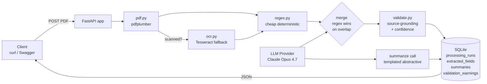

# Architecture

This document describes the runtime architecture of the Insurance Document
Summarizer: how a request flows through the system, what each module does, and
how data is persisted. For the rationale behind these decisions, see
[design_rationale.md](design_rationale.md).

## High-level view



The system is a single FastAPI process that accepts a PDF upload, runs a
sequential pipeline (PDF parse → optional OCR → regex pre-pass → LLM extraction →
merge → validation → summary), and persists every step to SQLite. Each upload
creates one `Document` row plus one `ProcessingRun` row with child
`ExtractedFields`, `Summary`, and `ValidationWarning` rows. Reprocessing the
same document inserts a new `ProcessingRun` rather than mutating the previous
one, which is how I get versioning on the cheap.

The hot path is sync because the demo target is one broker, one PDF at a time.
Wall-clock per request is roughly 10-30 seconds: 1-3s for PDF parse, 5-15s for
the extraction LLM call, 3-8s for the summary LLM call. The synchronous design
is documented as a trade-off in section 4 of the design rationale — async would
be a milestone (M5) once we cross 10 docs/min or 30-page documents become
common.

## Components

| Module | Responsibility |
|---|---|
| `app/main.py` | FastAPI app factory; `/healthz` endpoint; SQLAlchemy `create_all` on startup |
| `app/config.py` | `Settings` via `pydantic-settings`; env-driven model/provider selection |
| `app/storage.py` | DB engine, `SessionLocal`, `Base`, `save_pdf_bytes`, `get_db` dependency |
| `app/models.py` | SQLAlchemy ORM for the 5 tables (`documents`, `processing_runs`, `extracted_fields`, `summaries`, `validation_warnings`) |
| `app/schemas.py` | Pydantic API contracts (`DocumentResponse`, `ExtractedFieldsSchema`, `CoverageLimit`, ...) |
| `app/routes.py` | All HTTP endpoints (`/documents` CRUD + `/reprocess` + `/healthz`) |
| `app/pipeline.py` | Orchestration: parse → OCR? → regex → LLM → merge → validate → persist → summarize |
| `app/pdf.py` | `pdfplumber` page extraction with `layout=True`; `--- PAGE N ---` markers; scanned-PDF heuristic (chars/page < 100) |
| `app/ocr.py` | Tesseract fallback; auto-locates the binary across PATH/Homebrew/Linux paths; per-page rasterization at 200 DPI |
| `app/extractors/regex.py` | Cheap deterministic pre-pass for `policy_number`, dates, money; `merge_with_llm()` where regex wins overlap |
| `app/extractors/llm/base.py` | `LLMProvider` Protocol + `ExtractionResult` / `SummaryResult` dataclasses; vendor-neutral interface |
| `app/extractors/llm/prompts.py` | `EXTRACTION_SYSTEM_PROMPT`, `SUMMARY_SYSTEM_PROMPT`, `EXTRACTION_TOOL_SCHEMA` — all vendor-neutral |
| `app/extractors/llm/anthropic_provider.py` | Concrete `LLMProvider` for Anthropic; uses `tool_use` with `tool_choice` forced to `save_policy_fields` |
| `app/extractors/llm/__init__.py` | `get_llm_provider(settings)` factory selects implementation by `settings.llm_provider` |
| `app/validate.py` | Format checks + cross-field checks + source-grounding + confidence scoring (5-tier) |

## Database schema

Five tables, all UTC timestamps, defined via SQLAlchemy 2.x typed declarative
syntax in `app/models.py`. I designed the schema around three principles:
(1) the original PDF and the extraction must be separable, (2) the extraction
must be append-only-versionable without destroying history, and (3) every
extracted field must be queryable as a typed column while still preserving the
raw LLM JSON for forward compatibility.

### `documents`

The immutable record of what was uploaded. One row per upload. `pdf_sha256` is
indexed so we can short-circuit duplicate uploads in a future milestone (M15).
`extraction_method` is set by the pipeline after PDF/OCR detection: one of
`native`, `ocr`, or `scanned-unhandled`.

```sql
CREATE TABLE documents (
    id VARCHAR(36) PRIMARY KEY,
    filename VARCHAR(255) NOT NULL,
    pdf_path VARCHAR(512) NOT NULL,
    pdf_sha256 VARCHAR(64) NOT NULL,
    file_size_bytes INTEGER NOT NULL,
    page_count INTEGER,
    extraction_method VARCHAR(20),
    status VARCHAR(20) DEFAULT 'processing',
    error_message TEXT,
    uploaded_at DATETIME,
    deleted_at DATETIME
);
CREATE INDEX ix_documents_pdf_sha256 ON documents(pdf_sha256);
```

### `processing_runs`

Append-only audit trail of every extraction attempt against a document. The
first upload creates `run_number = 1`; each `/reprocess` adds the next run.
Token counts and prompt versions live here so we can A/B prompts in production
and trace which run produced which fields.

```sql
CREATE TABLE processing_runs (
    id INTEGER PRIMARY KEY AUTOINCREMENT,
    document_id VARCHAR(36) REFERENCES documents(id),
    run_number INTEGER NOT NULL,
    extraction_prompt_version VARCHAR(10) NOT NULL,
    summary_prompt_version VARCHAR(10) NOT NULL,
    model_id VARCHAR(50) NOT NULL,
    extraction_tokens_in INTEGER DEFAULT 0,
    extraction_tokens_out INTEGER DEFAULT 0,
    summary_tokens_in INTEGER DEFAULT 0,
    summary_tokens_out INTEGER DEFAULT 0,
    regex_fields_filled INTEGER DEFAULT 0,
    llm_fields_filled INTEGER DEFAULT 0,
    started_at DATETIME,
    completed_at DATETIME,
    status VARCHAR(20) DEFAULT 'success'
);
CREATE INDEX ix_processing_runs_document_id ON processing_runs(document_id);
```

### `extracted_fields`

The structured output of one processing run. Typed columns (`policy_number`,
dates, money) enable `WHERE`-clause queries for broker tools; `_json` columns
preserve the raw LLM output so new schema additions don't require migrations or
re-extraction. `confidence_json` and `extraction_method_per_field_json` carry
the per-field metadata produced by `validate.py` and the regex/LLM merge.

```sql
CREATE TABLE extracted_fields (
    id INTEGER PRIMARY KEY AUTOINCREMENT,
    processing_run_id INTEGER UNIQUE REFERENCES processing_runs(id),
    policy_number VARCHAR(64),
    insured_name VARCHAR(255),
    insurer_name VARCHAR(255),
    policy_type VARCHAR(64),
    effective_date DATE,
    expiration_date DATE,
    premium_amount NUMERIC(12, 2),
    premium_frequency VARCHAR(20),
    face_amount NUMERIC(14, 2),
    coverage_limits_json TEXT,
    exclusions_json TEXT,
    raw_extraction_json TEXT NOT NULL,
    confidence_json TEXT,
    extraction_method_per_field_json TEXT
);
CREATE INDEX ix_extracted_fields_policy_number ON extracted_fields(policy_number);
```

### `summaries`

One Markdown summary per processing run. Separated from `extracted_fields`
because summaries are regenerated independently of extraction in a future
milestone (M14 citation-augmented summaries needs the same fields but a new
summary).

```sql
CREATE TABLE summaries (
    id INTEGER PRIMARY KEY AUTOINCREMENT,
    processing_run_id INTEGER UNIQUE REFERENCES processing_runs(id),
    summary_markdown TEXT NOT NULL,
    summary_type VARCHAR(20) DEFAULT 'abstractive'
);
```

### `validation_warnings`

One row per warning produced by `validate.py` for a given run. Severity is one
of `info` / `warning` / `error`. `field_name` is nullable because some warnings
are document-level (e.g., cross-field date checks). Stored as a separate table
rather than a JSON column on `extracted_fields` so warnings can be filtered,
counted, and reported without parsing JSON.

```sql
CREATE TABLE validation_warnings (
    id INTEGER PRIMARY KEY AUTOINCREMENT,
    processing_run_id INTEGER REFERENCES processing_runs(id),
    field_name VARCHAR(64),
    severity VARCHAR(10) NOT NULL,
    message TEXT NOT NULL
);
CREATE INDEX ix_validation_warnings_processing_run_id ON validation_warnings(processing_run_id);
```

## Request lifecycle

What happens when a client `POST /documents` with a PDF, step by step. The
implementation is in `app/pipeline.py::process`.

1. **Validate upload** — `routes.py` rejects non-`.pdf` filenames with 400 and
   reads the upload bytes asynchronously.
2. **Magic-byte check** — `pipeline.py` rejects files missing the `%PDF` header
   with 400 and any upload over `MAX_PDF_MB` (default 20MB) with 413.
3. **Persist the bytes** — `storage.save_pdf_bytes()` writes the PDF to
   `./storage/pdfs/{uuid}.pdf` and returns the generated document UUID.
4. **Insert `Document` row** — status starts as `processing` so reviewers can
   see in-flight uploads if a row gets orphaned.
5. **Extract pages** — `pdf.extract_pages()` uses `pdfplumber.extract_text(layout=True)`
   page-by-page. Each page becomes a `PageText(page_num, text, char_count)`.
6. **Detect scanned PDFs** — `pdf.is_likely_scanned()` checks chars/page
   average. If under 100, the pipeline calls `ocr.ocr_pdf()` and sets
   `extraction_method = "ocr"`.
7. **Build full text** — `extract_full_text()` concatenates pages with
   `--- PAGE N ---` markers so the LLM can cite source pages.
8. **Regex pre-pass** — `regex.regex_extract()` finds `policy_number`, dates,
   and money. Returns only fields it could extract (missing fields are absent,
   not null).
9. **LLM extraction** — `llm.extract_fields()` calls Claude with `tool_use`
   forcing the `save_policy_fields` tool. Schema enforced at the API level.
10. **Merge** — `regex.merge_with_llm()` overlays regex over LLM (regex wins
    on overlap), tracking per-field origin in `origin_per_field`.
11. **Validate** — `validate.validate()` runs format checks, cross-field checks,
    source-grounding, and produces per-field confidence + warnings.
12. **Persist run + fields + warnings** — single transaction: `ProcessingRun`,
    `ExtractedFields`, `ValidationWarning` rows.
13. **Summarize** — `llm.summarize()` produces the Markdown summary using the
    extracted fields + full text. Stored in `summaries`. Summary failure is
    non-fatal: the run is still marked successful with a warning.
14. **Return** — `routes._document_to_response()` flattens everything into
    `DocumentResponse` and FastAPI serializes as JSON.

## Error handling

| Failure | HTTP status | Surfaced as |
|---|---|---|
| Filename not `.pdf` | 400 | `{"detail": "Expected a .pdf file"}` |
| Missing `%PDF` header | 400 | `{"detail": "Not a valid PDF (missing %PDF header)"}` |
| File over size limit | 413 | `{"detail": "PDF exceeds 20 MB limit"}` |
| `pdfplumber` fails to open | 502 | Wrapped pipeline failure; doc status `failed`, error in `error_message` |
| Zero extractable pages | 422 | `{"detail": "PDF has no extractable pages"}` |
| OCR failure on scanned PDF | (continues) | `extraction_method = "scanned-unhandled"`; pipeline proceeds with whatever native gave us |
| LLM API failure on extraction | 502 | `{"detail": "Pipeline failed: APIError: ..."}` |
| LLM API failure on summary | 200 | Extraction succeeds; warning logged ("Summary generation failed") |
| Validation throws | 200 | Extraction succeeds with empty confidence; warning logged ("Validation skipped") |
| Document not found | 404 | `{"detail": "Document not found"}` |
| Source PDF missing on disk | 404 | `{"detail": "Source PDF missing from storage"}` |

The principle: structural failures (bad PDF, missing file) fail fast with
clear status codes; downstream failures (summary, validation) degrade
gracefully because the primary extraction is the most important output.

## File layout

```
insurance-summarizer/
|-- README.md                              Project overview + quick start
|-- requirements.txt                       Python dependencies
|-- pyproject.toml                         Ruff + pytest config
|-- .env.example                           Settings template
|-- .gitignore
|-- insurance.db                           SQLite DB (gitignored)
|-- app/
|   |-- __init__.py
|   |-- main.py                            FastAPI factory + /healthz
|   |-- config.py                          pydantic-settings
|   |-- routes.py                          HTTP endpoints
|   |-- pipeline.py                        Orchestrator
|   |-- pdf.py                             pdfplumber + scanned detection
|   |-- ocr.py                             Tesseract fallback
|   |-- validate.py                        Source-grounding + confidence
|   |-- schemas.py                         Pydantic API contracts
|   |-- models.py                          SQLAlchemy ORM (5 tables)
|   |-- storage.py                         DB engine + file storage helpers
|   `-- extractors/
|       |-- __init__.py
|       |-- regex.py                       Deterministic pre-pass
|       `-- llm/
|           |-- __init__.py                get_llm_provider() factory
|           |-- base.py                    LLMProvider Protocol
|           |-- prompts.py                 Vendor-neutral prompts + tool schema
|           `-- anthropic_provider.py      Anthropic SDK implementation
|-- tests/
|   |-- conftest.py                        Fixtures (test client, in-memory DB, mock LLM)
|   |-- test_pdf.py                        PDF + scanned detection (6 tests)
|   |-- test_regex_extractor.py            Regex + merge (7 tests)
|   |-- test_validate.py                   Validation layers (6 tests)
|   `-- test_routes.py                     FastAPI integration (9 tests)
|-- eval/
|   |-- run_eval.py                        Eval harness entry point
|   |-- metrics.py                         Per-field accuracy metrics
|   `-- golden/                            Hand-labeled PDFs + ground truth JSON
|-- sample/
|   `-- leland_stanford_policy.pdf         Sample PDF for demo
|-- storage/pdfs/                          Uploaded PDFs (gitignored)
`-- docs/
    |-- architecture.md                    This file
    |-- design_rationale.md                Decisions + trade-offs
    `-- sample_summary.md                  Example output
```
